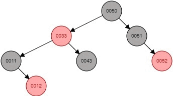
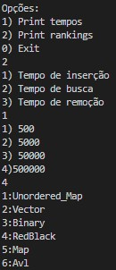
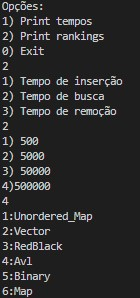
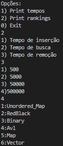
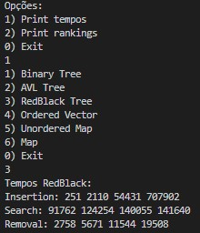
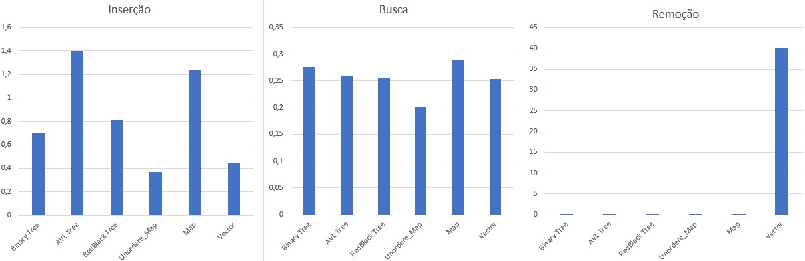

# Tree_Comparison
O objetivo do processo é comparar as estruturas em árvore vistas em sala, binária, avl e rubro negra, quanto a inserção, busca e remoção de pequenas,médias e grandes quantidades de pontos flutuantes. Para controle, usaremos também um vetor ordenado e as estruturas de c++, map e unordered_map. As comparações serão feitas quanto ao tempo em microsegundos.     
# Estrutura
Foi-se utilizado as estruturas de árvore [Bynari_Tree](https://github.com/mpiress/basic_tree), [AVL_Tree](https://github.com/mpiress/avl_tree), [RedBlack_Tree](https://github.com/mpiress/RedBlack) (como o repositório RedBlack não possuia o método de remoção, foi necessário criá-lo, baseado na litaratura do livro Introduction to Algorithms - Thomas Cormen, páginas 13-9 e 13-10 , mais detalhes na seção de lógica), além de utilizar as bibliotecas \<map>, <unordered_map> e \<vector>.     
Para comparação final temos uma estrutura *Tempos* que possui três vectors como atributos, Insert, Search e Remove, que armazem os tempos de cada operação nos arquivos de 500, 5000, 50000 e 500000 números.     

# Arquivos    
Para randomizarmos os números dos programas utilizamos o  método *void randomize()* presente em *rand.cpp*, que utiliza a função rand() com um range de 0 a 100 em float, em seguida inserimos 500000 destes numeros aleatórios no arquivo **rand500000.txt**. Após a inserção, utilizamos o método *arquivos()* para preencher os outros arquivos de dados de menores quantidades com frações do arquivo de 500000:      
- **50000.txt** - de 40000 até 90000   
- **5000.txt**  - de 37500 até 42500   
- **500.txt**   - de 37250 até 37750   

Utilizamos estas partes para possuir números comuns em todos os arquivos.      
Após setar os arquivos de dados, configuramos um arquivo de busca(**search.txt**). Manualmente foi inserido, 250 dados do arquivo de 500, 2500 do arquivo de 5000, 3000 do arquivo de 50000 e 3000 do arquivo de 500000, além de adicionarmos 1000 elementos sequenciais que garantem que alguns termos não estejam presentes na vez de buscar dados no arquivo de 500000. Para não buscarmos na mesma ordem que os termos foram inseridos, existe o método *shuffleSearch()*, que pega estes dados insere em um vetor, os embaralha utilizando a função *shuffle()* da biblioteca <algorithm>, e os insere novamente no arquivo.    

# Lógica
Como dito anteriormente todas as estruturas estão implementadas, a não ser a parte de remoção da árvore rubro negra, portanto ela deve ser implementada.       
Deve-se cobrir os seguintes casos para a remoção:

1) Quando nó a ser removido é vermelho e não possui filhos ou um único filho;      
2)  Quando nó a ser removido é vermelho e seu sucessor é vermelho;   
3)  Quando nó a ser removido é preto e seu sucessor é vermelho;   
4)  Quando nó a ser removido é preto e seu sucessor pe preto:    
	1) Quando os filhos do sucessor(x e w) possuem cores diferentes;     
	2) Quando um dos filhos do sucessor(x) é preto e seu irmão(w) e sobrinhos também são pretos;    
	3) Quando um dos filhos do sucessor(x) é preto, seu irmão(w) é preto, e seu sobrinho esquerdo é vermelho;    
	4) Quando um dos filhos do sucessor(x) é preto, seu irmão(w) é preto, e seu sobrinho direito é vermelho.

Para esses casos precisamos determinar um sucessor, e faremos isso a partir do mesmo caminhamento utilizado na árvore binária, ou seja, o filho direito mais profundo da subárvore esquerda. Partimos então a o que fazer em cada caso:

1) Remove análogamente à árvore binária;
2) Remove análogamente à árvore binária;
3) Remove análogamente à árvore binária porém pinta de preto o sucessor;    
4) Casos:    
   1) Troca as cores do sucessor e do filho vermelho do sucessor, e realiza rotação esquerda como pivô o sucessor;
   2) Troca a cor do irmão(w) do filho do sucessor, e verifica novamente a situação a partir do nó onde era o sucessor;
   3) Troca a cor do irmão(w) e sobrinho esquerdo do filho do sucessor, rotaciona para a direita como pivô o irmão(w), tendo assim uma situação semelhante ao caso 4.4;
   4) Rotaciona para a esquerda usando o sucessor como pivô, o irmão(w) do filho do sucessor recebe a cor do sucessor, o sucessor e o filho direito de w são pintados de preto.
 

<table>
   <tr>
      <td>Caso 1:</td>
      <td>Caso 2:</td>
      <td>Caso 3:</td>
   </tr>
   <tr>
      <td></td>
      <td></td>
      <td></td>
   </tr>
</table>

    
    
A lógica presente no main faz o seguinte, a partir do valor atribuído a *qtd* serão feitos essa quantidade de testes, para todas as estruturas possuímos uma struct *Tempos* em que o tempo de inserção, busca e remoção são somados em cada posição do vetor referente a cada arquivo de dados, isso é feito para todos os teste.   
Para cada estrutura, todos os dados de um arquivo são inseridos, em seguida todos os 10000 dados do arquivo de busca são procurados na estrutura e retornados para o usuário (caso não sejam encontrados, é retornado -1), e por fim, esses mesmos 10000 dados são removidos das estruturas. Isso é feito para cada uma das 6 estruturas.        
Logo após é apresentado ao usuário as opções para imprimir os tempos de cada árvore, de tal maneira:   

> Insertion: X Y Z W    
> Search: X Y Z W     
> Removal: X Y Z W    

Onde X, Y, Z e W se referem respectivamente aos arquivos de 500, 5000, 50000 e 500000 números.   
Também existe a opção de mostrar o ranking de cada, método escolhido para cada arquivo, por exemplo, caso o método escolhido seja de busca no arquivo de 50000:

> 1 - Unordered_Map     
> 2 - Map    
> 3 - Redblack    
> 4 - Binary    
> 5 - Avl    
> 6 - Vector    

Obs.:      
- Para randomizar novamente os arquivos, basta descomentar o inicio do código e o include da classe "rand.hpp". 

# Exemplo de execução
Após executar o programa, com *qtd*=10, obtivemos os seguintes rankings no arquivo de 500000:

<table>
   <tr>
      <td>Insertion</td>
      <td>Search</td>
      <td>Remove</td>
   </tr>
   <tr>
      <td></td>
      <td></td>
      <td></td>
   </tr>
</table>

 

Printamos tambem os tempos da RedBlack para testar o método:    

# Conclusão

A partir de uma pequena quantidade de casos testes com 500000 dados foi possível definir a estrutura unordered_map, ou hash, como a mais rápida, podemos atribuir esse resultado ao cálculo de chaves únicas que permitem a rápida localização dos itens.    
Vemos também que das três estruturas de árvores que possuíamos, a mais rápida foi a RedBlack, devemos atribuir isso ao seu alto nível de balanceamento, não requerindo tanto tempo na inserção quanto sua prima AVL e batendo o tempo de busca e remoção dela e da binária, devido justamente ao seu alto grau de balanceamento.    
Vimos também que um vetor ordenado se tornou extremamente inceficiente quanto à remoção, por ter de ser percorrido inteiramente até achar o item necessário para remoção.    
Observando os valores individuais de cada estrutura podemos dizer que retirando o unordered_map e o vector, as estruturas se assemelham em quesito tempo, claro que uma tem ganhos sobre a outra, mas analisando as estruturas binária, map e avl, seus tempos se aproximaram bastante para fazê-las até trocarem de posição dependendo do método.    
Concluímos também que apesar de os métodos de remoção e inserção da RedBlack parecerem custoso à primeira vista, eles na verdade possuem o segundo melhor tempo das árvores em 2/3 métodos. A seguir, gráficos de desempenho em segundos:      

A seguir apresentamos uma tabela com a percentagem de melhora entre a unordered_map e as outras estruturas, exemplo, a busca da Redblack está como 220,68% ou seja, a unordered_map é 2,2 vezes melhor que a Redblack nesse quesito.
<table>
   <tr>
      <td></td>
      <td>Insertion</td>
      <td>Search</td>
      <td>Remove</td>
   </tr>
   <tr>
      <td>RedBlack</td>
      <td>220,68%</td>
      <td>127,68%</td>
      <td>176,02%</td>
   </tr>
   <tr>
      <td>Binary</td>
      <td>190,06%</td>
      <td>137,55%</td>
      <td>187,39%</td>
   </tr>
   <tr>
      <td>AVL</td>
      <td>379,55%</td>
      <td>129,43%</td>
      <td>221,07%</td>
   </tr>
   <tr>
      <td>Map</td>
      <td>335,45%</td>
      <td>143,23%</td>
      <td>250,18%</td>
   </tr>
   <tr>
      <td>Vector</td>
      <td>121,16%</td>
      <td>126,05%</td>
      <td>351063,18%</td>
   </tr>
</table>

# Compilação e Execução

O programa possui um arquivo Makefile que realiza todo o procedimento de compilação e execução. Para tanto, temos as seguintes diretrizes de execução:

| Comando                |  Função                                                                                           |
| -----------------------| ------------------------------------------------------------------------------------------------- |
|  `make clean`          | Apaga a última compilação realizada contida na pasta build                                        |
|  `make`                | Executa a compilação do programa utilizando o gcc, e o resultado vai para a pasta build           |
|  `make run`            | Executa o programa da pasta build após a realização da compilação                                 |
