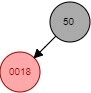
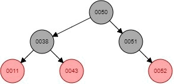

# Tree_Comparison
O objetivo do processo é comparar as estruturas em árvore vistas em sala, binária, avl e rubro negra, quanto a inserção, busca e remoção de pequenas,médias e grandes quantidades de pontos flutuantes. Para controle, usaremos também um vetor ordenado e as estruturas de c++, map e unordered_map. As comparações serão feitas quanto ao tempo em microsegundos.     
# Estrutura
Foi-se utilizado as estruturas de árvore [Bynari_Tree](https://github.com/mpiress/basic_tree), [AVL_Tree](https://github.com/mpiress/avl_tree), [RedBlack_Tree](https://github.com/mpiress/RedBlack) (como o repositório RedBlack não possuia o método de remoção, foi necessário criá-lo, baseado na litaratura do livro Introduction to Algorithms - Thomas Cormen, mais detalhes na seção de lógica), além de utilizar as bibliotecas \<map>, <unordered_map> e \<vector>.     
Para comparação final temos uma estrutura *Tempos* que possui três vectors como atributos, Insert, Search e Remove, que armazem os tempos de cada operação nos arquivos de 500, 5000, 50000 e 500000 números.     

# Arquivos    
Para randomizarmos os números dos programas utilizamos o  método *void randomize()* presente em *rand.cpp*, que utiliza a função rand() com um range de 0 a 100 em float, em seguida inserimos 500000 destes numeros aleatórios no arquivo **rand500000.txt**. Após a inserção, utilizamos o método *arquivos()* para preencher os outros arquivos de dados de menores quantidades com frações do arquivo de 500000:      
- **50000.txt** - de 40000 até 90000   
- **5000.txt**  - de 37500 até 42500   
- **500.txt**   - de 37250 até 37750   

Utilizamos estas partes para possuir números comuns em todos os arquivos.      
Após setar os arquivos de dados, configuramos um arquivo de busca(**search.txt**). Manualmente foi inserido, 250 dados do arquivo de 500, 2500 do arquivo de 5000, 3000 do arquivo de 50000 e 3000 do arquivo de 500000, além de adicionarmos 1000 elementos sequenciais que garantem que alguns termos não estejam presentes na vez de buscar dados no arquivo de 500000. Para não buscarmos na mesma ordem que os termos foram inseridos, existe o método *shuffleSearch()*, que pega estes dados insere em um vetor, os embaralha utilizando a função *shuffle()* da biblioteca <algorithm>, e os insere novamente no arquivo.    

# Lógica
Como dito anteriormente todas as estruturas estão implementadas, a não ser a parte de remoção da árvore rubro negra, portanto ela deve ser implementada.       
Deve-se cobrir os seguintes casos para a remoção:

1) Quando nó a ser removido é vermelho e não possui filhos ou um único filho;      
2)  Quando nó a ser removido é vermelho e seu sucessor é vermelho;   
3)  Quando nó a ser removido é preto e seu sucessor é vermelho;   
4)  Quando nó a ser removido é preto e seu sucessor pe preto:    
	1) Quando os filhos do sucessor(x e w) possuem cores diferentes;     
	2) Quando um dos filhos do sucessor(x) é preto e seu irmão(w) e sobrinhos também são pretos;    
	3) Quando um dos filhos do sucessor(x) é preto, seu irmão(w) é preto, e seu sobrinho esquerdo é vermelho;    
	4) Quando um dos filhos do sucessor(x) é preto, seu irmão(w) é preto, e seu sobrinho direito é vermelho.

Para esses casos precisamos determinar um sucessor, e faremos isso a partir do mesmo caminhamento utilizado na árvore binária, ou seja, o filho direito mais profundo da subárvore esquerda. Partimos então a o que fazer em cada caso:

1) Remove análogamente à árvore binária;
2) Remove análogamente à árvore binária;
3) Remove análogamente à árvore binária porém pinta de preto o sucessor;    
4) Casos:    
   1) Troca as cores do sucessor e do filho vermelho do sucessor, e realiza rotação esquerda como pivô o sucessor;
   2) Troca a cor do irmão(w) do filho do sucessor, e verifica novamente a situação a partir do nó onde era o sucessor;
   3) Troca a cor do irmão(w) e sobrinho esquerdo do filho do sucessor, rotaciona para a direita como pivô o irmão(w), tendo assim uma situação semelhante ao caso 4.4;
   4) Rotaciona para a esquerda usando o sucessor como pivô, o irmão(w) do filho do sucessor recebe a cor do sucessor, o sucessor e o filho direito de w são pintados de preto.
 

<table>
   <tr>
      <td>Caso 1:</td>
      <td>Caso 2:</td>
      <td>Caso 3:</td>
   </tr>
   <tr>
      <td></td>
      <td></td>
      <td></td>
   </tr>
</table>
<table>
   <tr>
      <td>Caso 4.1:</td>
      <td>Caso 4.2:</td>
      <td>Caso 4.3:</td>
   </tr>
   <tr>
      <td></td>
      <td></td>
      <td></td>
   </tr>
</table>

Obs.:      
- O arquivo "result.txt" deve ser observado para ver a codificação final. 

# Exemplo de execução

# Conclusão

O algoritmo de huffman para redução de arquivos é muito bom quando palavras possuem várias recorrências, já que transformam essa unica palavra pra uma muito menor. (Exemplo em filosofia.txt e result.txt, basta comparar o tamanho do arquivo)

# Compilação e Execução

O programa possui um arquivo Makefile que realiza todo o procedimento de compilação e execução. Para tanto, temos as seguintes diretrizes de execução:

| Comando                |  Função                                                                                           |
| -----------------------| ------------------------------------------------------------------------------------------------- |
|  `make clean`          | Apaga a última compilação realizada contida na pasta build                                        |
|  `make`                | Executa a compilação do programa utilizando o gcc, e o resultado vai para a pasta build           |
|  `make run`            | Executa o programa da pasta build após a realização da compilação                                 |
